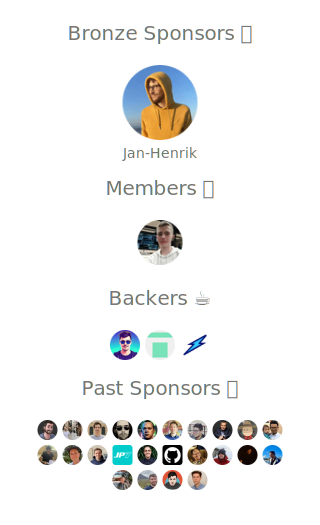

<!-- prettier-ignore-start -->
<!-- markdownlint-disable-next-line MD041 -->

<!-- prettier-ignore-end -->

# TypeGraphQL

[](https://github.com/MichalLytek/type-graphql/actions/workflows/release.yml)
[](https://github.com/MichalLytek/type-graphql/actions/workflows/website.yml)
[](https://github.com/MichalLytek/type-graphql/actions/workflows/codeql.yml)
[](https://discord.gg/cWnBAQcbg2)
[](https://codecov.io/gh/MichalLytek/type-graphql)
[](https://www.npmjs.com/package/type-graphql)
[](https://opencollective.com/typegraphql)

Create [GraphQL](https://graphql.org) schema and resolvers with [TypeScript](https://www.typescriptlang.org), using classes and decorators!

**<https://typegraphql.com>**

[](https://opencollective.com/typegraphql)

## Introduction

**TypeGraphQL** makes developing GraphQL APIs an enjoyable process, i.e. by defining the schema using only classes and a bit of decorator magic.

So, to create types like object type or input type, we use a kind of DTO class.
For example, to declare `Recipe` type we simply create a class and annotate it with decorators:

```ts
@ObjectType()
class Recipe {
  @Field(type => ID)
  id: string;

  @Field()
  title: string;

  @Field(type => [Rate])
  ratings: Rate[];

  @Field({ nullable: true })
  averageRating?: number;
}
```

And we get the corresponding part of the schema in SDL:

```graphql
type Recipe {
  id: ID!
  title: String!
  ratings: [Rate!]!
  averageRating: Float
}
```

Then we can create queries, mutations and field resolvers. For this purpose, we use controller-like classes that are called "resolvers" by convention. We can also use awesome features like dependency injection and auth guards:

```ts
@Resolver(Recipe)
class RecipeResolver {
  // dependency injection
  constructor(private recipeService: RecipeService) {}

  @Query(returns => [Recipe])
  recipes() {
    return this.recipeService.findAll();
  }

  @Mutation()
  @Authorized(Roles.Admin) // auth guard
  removeRecipe(@Arg("id") id: string): boolean {
    return this.recipeService.removeById(id);
  }

  @FieldResolver()
  averageRating(@Root() recipe: Recipe) {
    return recipe.ratings.reduce((a, b) => a + b, 0) / recipe.ratings.length;
  }
}
```

And in this simple way, we get this part of the schema in SDL:

```graphql
type Query {
  recipes: [Recipe!]!
}

type Mutation {
  removeRecipe(id: String!): Boolean!
}
```

## Motivation

We all know that GraphQL is great and solves many problems we have with REST APIs, like Over-Fetching and Under-Fetching. But developing a GraphQL API in Node.js with TypeScript is sometimes a bit of a pain. Why? Let's take a look at the steps we usually have to take.

First, we create all the GraphQL types in `schema.graphql` using SDL. Then we create our data models using [ORM classes](https://github.com/typeorm/typeorm), which represent our DB entities. Then we start to write resolvers for our queries, mutations and fields, but this forces us to first create TS interfaces for all arguments, inputs, and even object types.

Only then can we implement the resolvers using weird generic signatures and manually performing common tasks, like validation, authorization and loading dependencies:

```ts
export const getRecipesResolver: GraphQLFieldResolver<void, Context, GetRecipesArgs> = async (
  _,
  args,
  ctx,
) => {
  // common tasks repeatable for almost every resolver
  const repository = TypeORM.getRepository(Recipe);
  const auth = Container.get(AuthService);
  await joi.validate(getRecipesSchema, args);
  if (!auth.check(ctx.user)) {
    throw new NotAuthorizedError();
  }

  // our business logic, e.g.:
  return repository.find({ skip: args.offset, take: args.limit });
};
```

The biggest problem is redundancy in our codebase, which makes it difficult to keep things in sync. To add a new field to our entity, we have to jump through all the files - modify an entity class, the schema, as well as the interface. The same goes for inputs or arguments. It's easy to forget to update one piece or make a mistake with a single type. Also, what if we've made a typo in the field name? The rename feature (F2) won't work correctly.

Tools like [GraphQL Code Generator](https://github.com/dotansimha/graphql-code-generator) or [graphqlgen](https://github.com/prisma/graphqlgen) only solve the first part - they generate the corresponding interfaces (and resolvers skeletons) for our GraphQL schema but they don't fix the schema <--> models redundancy and developer experience (F2 rename won't work, you have to remember about the codegen watch task in the background, etc.), as well as common tasks like validation, authorization, etc.

**TypeGraphQL** comes to address these issues, based on experience from a few years of developing GraphQL APIs in TypeScript. The main idea is to have only one source of truth by defining the schema using classes and some help from decorators. Additional features like dependency injection, validation and auth guards help with common tasks that normally we would have to handle ourselves.

## Documentation

The documentation, installation guide, and detailed description of the API and all of its features are [available on the website](https://typegraphql.com).

### Getting started

A full getting started guide with a simple walkthrough (tutorial) can be found at [getting started docs](https://typegraphql.com/docs/getting-started.html).

### Video tutorial

If you prefer video tutorials, you can watch [Ben Awad](https://github.com/benawad)'s [TypeGraphQL video series](https://www.youtube.com/playlist?list=PLN3n1USn4xlma1bBu3Tloe4NyYn9Ko8Gs) on YouTube.

### Examples

You can also check the [examples folder](./examples) in this repository for more examples of usage: simple fields resolvers, DI Container support, TypeORM integration, automatic validation, etc.

The [Tests folder](./tests) might also give you some tips on how to get various things done.

## Security contact information

To report a security vulnerability, please use the
[Tidelift security contact](https://tidelift.com/security).
Tidelift will coordinate the fix and disclosure.

## The future

The currently released version is a stable 1.0.0 release. It is well-tested (97% coverage, ~500 test cases) and has most of the planned features already implemented. Plenty of companies and independent developers are using it in production with success.

However, there are also plans for a lot more features like better TypeORM, Prisma and DataLoader integration, custom decorators and metadata annotations support - [the full list of ideas](https://github.com/MichalLytek/type-graphql/issues?q=is%3Aissue+is%3Aopen+label%3A"Enhancement+%3Anew%3A") is available on the GitHub repo. You can also keep track of [development's progress on the project board](https://github.com/MichalLytek/type-graphql/projects/1).

If you have any interesting feature requests, feel free to open an issue on GitHub so we can discuss that!

## Support

**TypeGraphQL** is an MIT-licensed open-source project. This framework is a result of the tremendous amount of work - sleepless nights, busy evenings and weekends.

It doesn't have a large company that sits behind it - its ongoing development is possible only thanks to the support of the community.

[](https://opencollective.com/typegraphql)

### Gold Sponsors 🏆

> Please ask your company to support this open source project by [becoming a gold sponsor](https://opencollective.com/typegraphql/contribute/gold-sponsors-8340) and getting a premium technical support from our core contributors.

### Silver Sponsors 🥈

> Please ask your company to support this open source project by [becoming a silver sponsor](https://opencollective.com/typegraphql/contribute/silver-sponsors-14804).

### Bronze Sponsors 🥉

<!-- markdownlint-disable MD033 -->

| [](https://www.ligrsystems.com) | [](https://www.joinlifex.com) | [](https://instinctools.com/manufacturing) | [](https://www.vpsserver.com) |
| :------------------------------------------------------------------------------------------------------------------: | :--------------------------------------------------------------------------------------: | :--------------------------------------------------------------------------------------------------------------: | :---------------------------------------------------------------------------------------------: |
|                               [**Live Graphic Systems**](https://www.ligrsystems.com)                                |                       [**LifeX Aps**](https://www.joinlifex.com/)                        |                            [**instinctools**](https://instinctools.com/manufacturing)                            |                           [**VPS Server**](https://www.vpsserver.com)                           |

| [](https://www.nongamstopbets.com/casinos-not-on-gamstop/) | [](https://casinodeps.co.nz/1-dollar-casinos/) | [](https://uk.nonstopcasino.org/non-gamstop-casinos/) | [](https://sidesmedia.com/) | [](https://insfollowpro.com/) | [](https://www.socialfollowers.uk/buy-tiktok-followers/) |
| :---------------------------------------------------------------------------------------------------------------------------------: | :-------------------------------------------------------------------------------------------------------------------: | :------------------------------------------------------------------------------------------------------------------------------: | :------------------------------------------------------------------------------------------: | :------------------------------------------------------------------------------------------------: | :-----------------------------------------------------------------------------------------------------------------------------------: |
|                            [**NonGamstopBets**](https://www.nongamstopbets.com/casinos-not-on-gamstop/)                             |                             [**CasinoDeps**](https://casinodeps.co.nz/1-dollar-casinos/)                              |                             [**Non Stop Casino**](https://uk.nonstopcasino.org/non-gamstop-casinos/)                             |                          [**SidesMedia**](https://sidesmedia.com/)                           |                           [**Insfollowpro**](https://insfollowpro.com/)                            |                             [**Social Followers**](https://www.socialfollowers.uk/buy-tiktok-followers/)                              |

<!-- markdownlint-enable MD033 -->

[](https://opencollective.com/typegraphql)

### Members 💪

[](https://opencollective.com/typegraphql#contributors)

### GitHub Sponsors

[](https://github.com/sponsors/TypeGraphQL)

## Community

- Visit the [Official Website](https://typegraphql.com)
- Chat on [Discord](https://discord.gg/cWnBAQcbg2)

## Want to help?

Want to file a bug, contribute some code, or improve the documentation? Great! Please read our
guidelines for [CONTRIBUTING](./CONTRIBUTING.md) and then check out one of our [help-wanted issues](https://github.com/MichalLytek/type-graphql/labels/Help%20Wanted%20%3Asos%3A).
